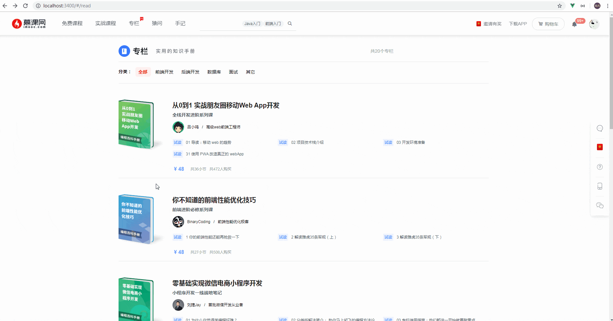
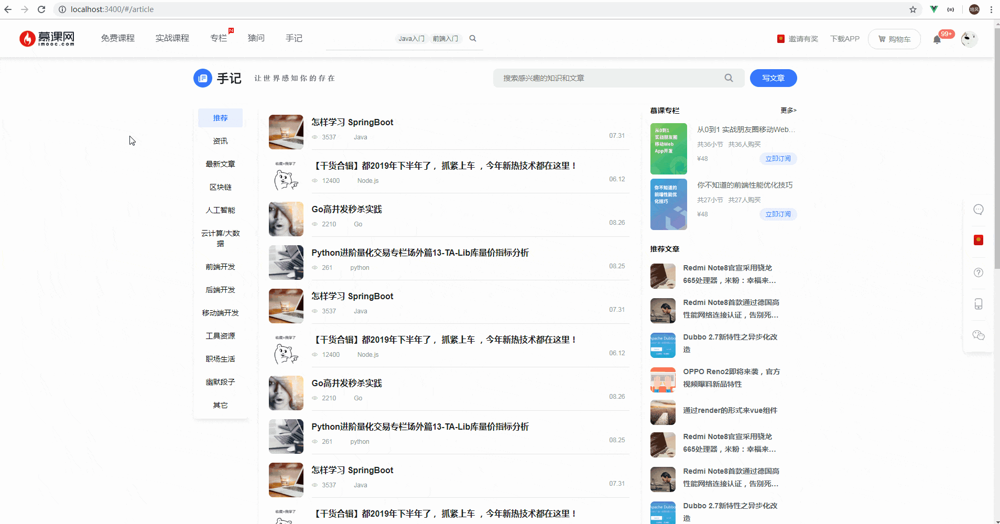
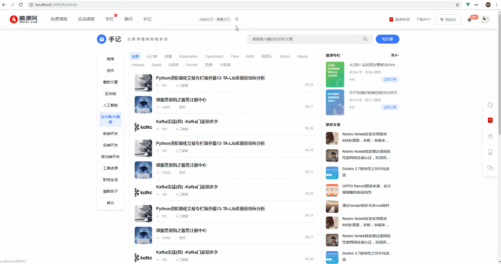
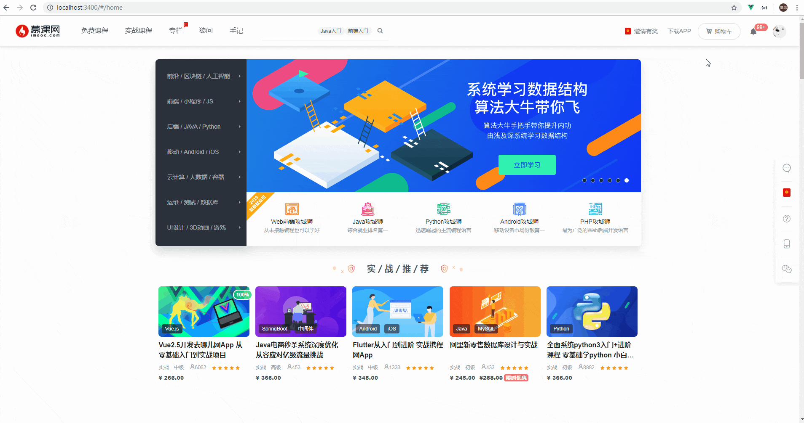
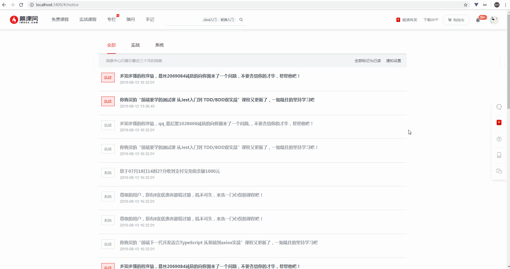

# 介绍
`vue-mooc`是一个使用`Vue`相关技术栈，高仿[慕课网](https://www.imooc.com/)PC端的一个项目，项目中涉及到的技术栈如下：

**Vue生态**:
* `Vue.js`：基础框架，[Vue.js官网](https://cn.vuejs.org/)。
* `Vue-cli3.0+`：一个`Vue`官方提供的一个脚手架工具，它提供了标准的目录结构和一些必要的配置，[Vue-cli3.0官网](https://cli.vuejs.org/zh/)
* `Vuex`：数据状态管理工具，[Vuex官网](https://vuex.vuejs.org/)。
* `Vue-router`：路由管理工具，[Vue-router官网](https://router.vuejs.org/)。
* `VuePress`：撰写静态站点的工具(你所看到的本站点是采用`VuePress1.x`)，[VuePress官网](https://v1.vuepress.vuejs.org/)。

**CSS预编译器**：
* `Stylus`：一种`CSS`预编译工具，类似的还有`Sass/Less`，[Stylus官网](https://www.zhangxinxu.com/jq/stylus/)

**数据请求**：
* `axios`：一个非常出名的`HTTP`请求工具，[axios官网](http://www.axios-js.com/)

**服务端接口**：
* `koa`框架：使用`koa2`Node服务端框架，[Koa官网](https://koa.bootcss.com/)
* `mongoose`：使用`mongoose`来链接和操作`mongodb`。[Mongoose官网](https://www.mongoose.com/)
* `mongodb`：使用非关系型数据库`mongodb`来存储数据。[Mongodb官网](https://www.mongodb.com/)

## 背景
在目前的业务搬砖中，接触到的项目大多是中后台项目，每日搬砖无非就是拿`element-ui`轮子一把嗦，轮子仔当久了自己也安逸了，痛定思痛后决定当一会轮子的制造者。<br/>
本项目中关于基础组件的封装，**尽可能**抛弃使用`element-ui`，而采用自己封装，知其然同时又知其所以然。

**基础公共组件完成情况**：<br/>
<input type="checkbox" checked/> Container(布局容器) <br/>
<input type="checkbox" checked/> Star(星级评分) <br/>
<input type="checkbox" checked/> Badge(标记)<br/>
<input type="checkbox" checked/> Switch(开关)<br/>
<!-- <input type="checkbox" checked/> Timeline(时间线)<br/> -->
<input type="checkbox" checked/> Progress(进度条)<br/>
<!-- <input type="checkbox" checked/> Step(步骤条)<br/> -->
<!-- <input type="checkbox" checked/> Breadcrumb(面包屑导航)<br/> -->
<input type="checkbox" checked/> BackTop(返回顶部)<br/>
<input type="checkbox" checked/> Button(按钮)<br/>
<input type="checkbox" checked/> Message(消息提示)<br/>
<input type="checkbox" checked/> MessageBox(消息确认)<br/>
<input type="checkbox" checked/> Carousel(轮播)<br/>
<input type="checkbox" checked/> Dialog(弹窗)<br/>
<input type="checkbox" checked/> Pagination(基于element-ui二次封装)<br/>
<!-- <input type="checkbox" checked/> Divider(分割线)<br/> -->

## 源码地址&开发

如果你需要看一看此项目的源码，请移步:point_right: [源码仓库](https://github.com/wangtunan/vue-mooc)

### 开发

一方面由于采用`Node+MongoDB`来撰写后端接口，另一方面暂时还不方便部署在云服务器，因此此项目需要本地安装`MongoDB`数据库，你可以点击[MongoDB官网](https://www.mongodb.com/)去下载最新版本的。

```sh
# 克隆代码
$ git clone https://github.com/wangtunan/vue-mooc.git

# 安装依赖
$ npm install

# 启动Node接口
$ npm run node

# 启动本地开发服务
$ npm run serve
```


## 静态站点介绍
本静态站点采用[VuePress1.x](https://v1.vuepress.vuejs.org/)撰写而来，你可以在其官网很方便的找到该如何配置以及搭建属于自己的静态站点。<br/>
如果你对于官网中的文档不太那么理解，那么请移步:point_right: [从今天开始拿起VuePress打造属于自己的专属博客](https://wangtunan.github.io/blog/vuepress/)<br/>
这篇博客也同时提供了一个简单的[VuePress配置Demo](https://github.com/wangtunan/vuepress-blog-demo)<br/>
如果你想要一个更贴近于实际的配置参考，那么请移步:point_right:[本站点的VuePress站点](https://github.com/wangtunan/vue-mooc-site)

## 部分页面功能演示

### 首页


### 免费课程


### 实战课程

### 专栏


### 猿问

### 手记


### 购物车


### 消息中心


### 订单中心


### 个人中心
