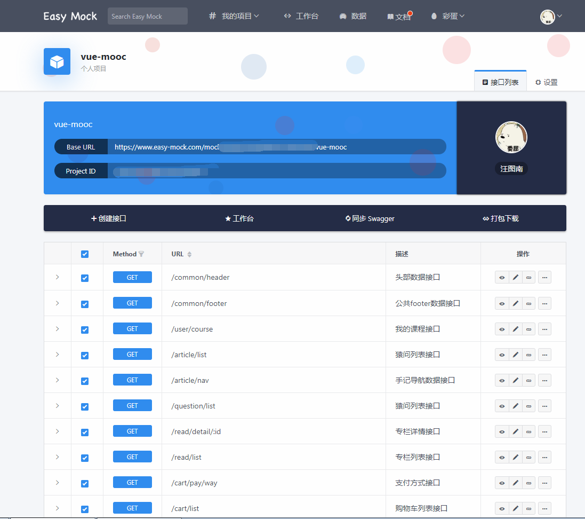
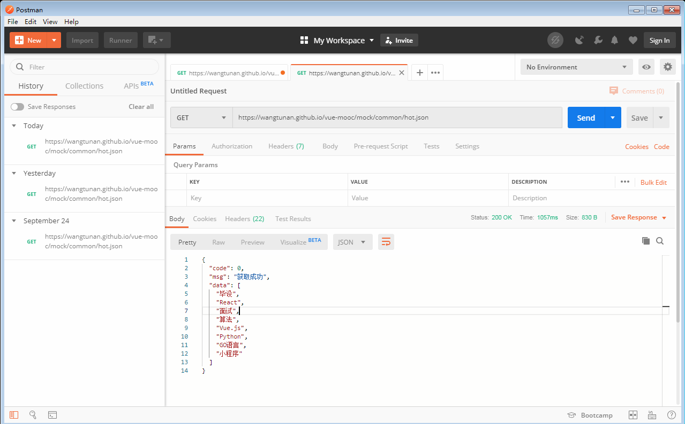

# Mock数据
::: warning
在最早的一版中，我们使用的是`Mock`数据的方式来处理我们的请求，虽然现在我们已经使用了`Node`重写了后端接口，但我们依然选择保留对于这一部分的介绍，因为`Mock`数据在某些情况下依然能给我们很大的帮助。
:::
## easy-mock远程接口服务
::: warning
`easy-mock`对于个人开发者而言，无疑是一个非常优秀的平台，但由于是免费的，接口服务可能会经常性的挂掉，所以我们在后来的版本中，逐渐摒弃了这种方式。
:::
在`vue-mooc`最初的时候，我们使用了`easy-mock`的远程接口服务，如果你也对[easy-mock](https://www.easy-mock.com/)感兴趣的话，那么你可以去注册一个账号，`easy-mock`是免费的，
以下是使用`easy-mock`创建的一些接口列表：




## 本地Mock数据
::: tip
对于不喜欢使用`mock.js`这一类工具的人来说， 一方面自己手动写一份`mock`的`.json`文件，无疑是极具成就感的，另一方面，在没有接口支持的情况下，自己手动`mock`的方式也是非常普遍的。
:::
`vue-mooc`项目全部使用了`mock`数据的方式来实现，以下是`public/mock`目录下所有的`json`文件：
``` sh
mock
|-- article                             # 手记模块
|   |-- list.json                       # 手记列表数据
|   |-- nav.json                        # 手记导航数据
|-- cart                                # 购物车模块
|   |-- cart.json                       # 购物车数据
|   |-- pay-way.json                    # 支付方式数据
|-- common                              # 公共模块
|   |-- footer.json                     # 底部模块数据
|   |-- header.json                     # 头部模块数据
|   |-- hot.json                        # 热词模块数据
|   |-- search-history.json             # 搜索历史模块数据
|-- course                              # 免费课程模块
|   |-- detail.json                     # 免费课程详情数据
|   |-- list.json                       # 免费课程列表数据
|   |-- nav.json                        # 免费课程导航数据
|-- home                                # 首页模块
|   |-- allstar.json                    # 全明星学员数据
|   |-- article.json                    # 手记数据
|   |-- course.json                     # 课程数据
|   |-- nav.json                        # 导航数据
|   |-- slider.json                     # 滚动轮播数据
|   |-- teacher.json                    # 精英讲师数据
|-- lesson                              # 实战课程模块
|   |-- detail.json                     # 实战课程详情数据
|   |-- list.json                       # 实战课程列表数据
|   |-- nav.json                        # 实战课程导航数据
|-- notice                              # 消息中心模块
|   |-- notice.json                     # 消息列表数据
|   |-- setting.json                    # 消息设置数据
|-- question                            # 猿问模块
|   |-- question.json                   # 猿问列表数据
|-- read                                # 专栏模块
|   |-- detail.json                     # 专栏详情数据
|   |-- read.json                       # 专栏列表数据
|-- user                                # 订单中心&个人中心模块
|   |-- bill.json                       # 消费记录数据
|   |-- consult.json                    # 课程咨询数据
|   |-- course.json                     # 我的课程数据
|   |-- curpon.json                     # 我的余额数据
|   |-- login.json                      # 登录数据
|   |-- order.json                      # 我的订单数据
|   |-- recharge.json                   # 我的发票数据
|   |-- register.json                   # 注册数据
|   |-- userinfo.json                   # 个人信息数据
```
有了上面的`mock`数据后，我们需要在`vue.config.js`里面设置一下请求代理，如下：
```js
devServer: {
  port: 3400,
  proxy: {
    '/mock': {
      target: 'http://localhost:3400'
    }
  }
}
```
添加完以上代理代码后，我们还需要进行安装`axios`：
```js
// 安装axios
$ npm install axios --save
```
安装完以后，我们需要在`utils`目录下新建`axios.js`文件，并添加拦截代码：
```js
import axios from 'axios'
import { Message } from 'element-ui'
import { ERR_OK } from 'api/config.js'

const service = axios.create({
  timeout: 10000
})

// 请求拦截
service.interceptors.request.use(
  config => {
    return config
  },
  error => {
    return Promise.reject(error)
  }
)

//响应拦截
service.interceptors.response.use(
  response => {
    let {status, data} = response
    if (status !== 200) {
      Message.error('网络异常，请刷新或者重试!')
      return Promise.reject('网络异常!')
    }
    if (data.code !== ERR_OK) {
      Message.error(data.msg || '接口请求异常，请重试!')
      return Promise.reject(data.msg || '接口异常!')
    }
    return Promise.resolve(data)
  },
  error => {
    return Promise.reject(error)
  }
)

export default service
```

`axios`统一拦截后，我们就可以在`src/api`目录下撰写我们的请求接口了，例如下面的案例：
```js
// src/api/test.js

import axios from 'utils/axios.js'

// get请求接口
export function getTest () {
  return axios.get('/mock/test.json')
}
```

撰写完毕后，我们可以在页面中引入这个请求接口，当我们调用这个`getTest()`方法时，`vue.config.js`中的`proxy`会自动帮我们把接口转发到`http://localhost:3400/mock/test.json`，即`public/mock/test.json`。

## 更方便的Mock方式
::: tip
我们不光要本地`mock`，还要发布到`Github Pages`上，可以随时预览我们的项目。
:::
由于我们采用打包部署到`Github Pages`上的方式，同时我们本地`mock`的数据也会被打包进`dist`目录，但由于我们使用的是本地`mock`数据的方式。也就是说：如果我们不改动我们的代码，那么我们是预览不了的，因为`proxy`只支持本地服务。<br/><br/>
为了解决以上问题，我们需要按下面的步骤进行解决：
* 找到一种可以通过在线请求接口方式
* 配置在线请求。
* 进行本地开发和部署接口请求方式的区分

**解决问题一**：由于我们可以把`Github Pages`当做一个远程服务器，那么我们发布后的`mock`数据，是可以通过一定的方式获取到的，它的获取方式如下：
* 假如我们部署的地址是`https://wangtunan.github.io/vue-mooc/`，那么我们可以通过`https://wangtunan.github.io/vue-mooc/mock/xxxx.json`的方式请求到我们`mock`的数据，既然想法有了，那么我们用`postman`实际测试一下：


**解决问题二、三**：通过第一个步骤，我们已经知道了，我们可以通过一定的手段拿到我们发布后的`mock`数据请求地址，那么我们现在来动手配置一下。<br/>
在`src/api/`目录下，新建一个`config.js`的文件，此文件放置所有与请求相关的变量定义：
```js
// 接口请求错误状态码
export const ERR_OK = 0
// axios请求基地址
export const BASE_URL = 'https://wangtunan.github.io/vue-mooc'
// 通过环境变量区分是否为本地开发，还是生产部署
export const IS_MOCK_LOCAL = process.env.NODE_ENV === 'development'
```

撰写完以上代码后，我们最后需要在`utils/axios.js`文件中做一点小小的改动(参考代码高亮部分)：
```js {4,7}
import axios from 'axios'
import { Message } from 'element-ui'
import { ERR_OK } from 'api/config.js'
import { BASE_URL, IS_MOCK_LOCAL } from 'api/config.js'

const service = axios.create({
  baseURL: IS_MOCK_LOCAL ? '' : BASE_URL,
  timeout: 10000
})

// 请求拦截
service.interceptors.request.use(
  config => {
    return config
  },
  error => {
    return Promise.reject(error)
  }
)

//响应拦截
service.interceptors.response.use(
  response => {
    let {status, data} = response
    if (status !== 200) {
      Message.error('网络异常，请刷新或者重试!')
      return Promise.reject('网络异常!')
    }
    if (data.code !== ERR_OK) {
      Message.error(data.msg || '接口请求异常，请重试!')
      return Promise.reject(data.msg || '接口异常!')
    }
    return Promise.resolve(data)
  },
  error => {
    return Promise.reject(error)
  }
)

export default service
```
以上做法的好处在于：
* 方便本地开发和生产部署之前快速切换
* 当远程接口出现问题的时候，本地开发依旧不受影响。

来自`easy-mock`暴击之后，深刻的领悟。。。

