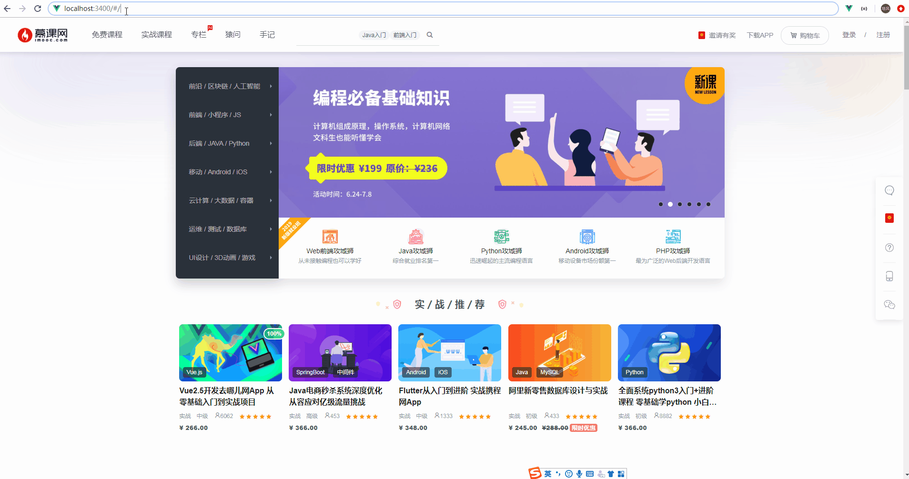

# 路由&路由拦截
::: tip 目录
`src/router/index.js`
:::
照理，我们并不会在这里讲解关于`Vue-Router`路由相关的知识，如果你对于`Vue-Router`不是很熟悉的话，请点击[Vue-Router官网]阅读更多内容。
## 路由懒加载
::: tip
路由懒加载是结合了`Vue`的异步组件和`Webpack`的代码分割来实现的。
:::
由于我们是`SPA`单页面应用，假设有两个模块`a`和`b`，我们使用路由懒加载的方式：
```js
const AModule = () => import('./a.vue')
const BModule = () => import('./b.vue')
```
这样懒加载以后，我们就能实现：当我们去访问模块`a`的时候才会去加载`a`这一块的内容，当我们去访问模块`b`的时候才会去加载`b`这一块的内容。

## 滚动行为
假设我们想每次切换不同的路由的时候，都让页面滚动到最顶部的话，我们可以用路由的滚动行为来定义这种行为：
```js
// 省略了routes的定义
const router = new Router({
  routes: routes,
  scrollBehavior () {
    return {
      x: 0,
      y: 0
    }
  }
})
```

## 路由拦截
::: tip
某些页面并不是每一个人都有权限去访问，需要登录或者其他操作后才能访问，需要我们对这些页面进行权限控制。
:::
在路由定义中，我们通过元信息`meta`。在它之上，定义一个标记，来区分是否进行权限校验：
```js
const routes = [
  {
    path: '/order',
    name: 'OrderIndex',
    component:OrderIndex,
    meta: {
      requireAuth: true
    }
  }
]

// 路由拦截
router.beforeEach((to, from, next) => {
  let userinfo = getUserInfo()
  if (to.meta.requireAuth) {
    // 登录以后才可以访问
    if (userinfo.id) {
      next()
    } else{
      store.commit('login/SET_SHOW_LOGIN', true)
    }
  } else {
    next()
  }
})
```
设置完路由拦截后，它的实际效果像下面这样：


## 路由案例
```js
import Vue from 'vue'
import Router from 'vue-router'
import store from '../store/index.js'
import { getUserInfo } from 'utils/cache.js'
Vue.use(Router)

const Home = () => import('pages/home/index.vue') // 首页路由
const OrderIndex = () => import('pages/order/index.vue') // 订单中心路由

const routes = [
  {
    path: '/',
    name: 'Index',
    redirect: '/home'
  },
  {
    path: '/home',
    name: 'Home',
    component:Home 
  },
  {
    path: '/order',
    name: 'OrderIndex',
    component:OrderIndex,
    meta: {
      requireAuth: true
    }
  }
]

const router = new Router({
  routes: routes,
  scrollBehavior () {
    return {
      x: 0,
      y: 0
    }
  }
})

// 路由拦截
router.beforeEach((to, from, next) => {
  let userinfo = getUserInfo()
  if (to.meta.requireAuth) {
    if (userinfo.id) {
      next()
    } else{
      store.commit('login/SET_SHOW_LOGIN', true)
    }
  } else {
    next()
  }
})


export default router