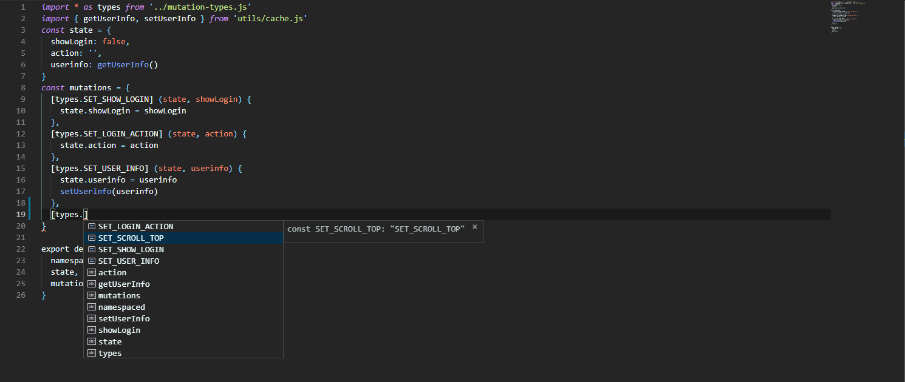

# Vuex&缓存
::: tip 目录
`src/store/index.js`
:::
`vue-mooc`是一个实战类项目，并不会在指南中描述过多的基础知识相关的内容，如果你对`Vuex`还不是很熟悉的话，你可以点击[Vuex官网](https://vuex.vuejs.org/)去阅读更多内容。

## Vuex目录结构
```sh
store                               # Vuex目录
|-- index.js                        # Vuex入口文件
|-- getters.js                      # 所有State的getters
|-- mutation-types.js               # 所有Vuex的types
|-- modules                         # Vuex模块部分
```
`vue-mooc`项目是像上面那样搭建`Vuex`目录结构的，它们各自的作用也像上面描述的那样。

## Types
::: tip
定义`types`，好处是能让我们最大程度上避免书写错误从而导致一些问题。
:::
如果我们不定义`types`的话，那么我们可能会写如下的代码：
```js
// state
const state = {
  name: '',
  age: 0
}
// mutation
const mutations = {
  setName (state, name) {
    state.name = name
  },
  setAge (state, age) {
    state.age = age
  }
}
```
以上代码在一定程度上固然是没有什么问题的，它也是我们常见的`JavaScript`代码书写风格，但我们想更加**容易理解**，更加**容易维护**，同时也更加**容易避免错误**一些。<br/>
以上问题，我们可以通过定义`mutation-types`来解决，想象一下，如果所有的`mutations`里面的方法都像`setName`、`setAge`那样容易记和容易书写的话，我们大可不必定义`types`，但在实际的开发过程中，方法名往往不太容易记住，如果我们在很多地方使用的话，难免会在某一个地方写错，可能就像下面这样：
```js
// state
const state = {
  name: ''
}
const mutations = {
  setUserNickName (state, name) {
    state.name = name
  }
}
// 在.vue文件中
const nickName = '尼古拉斯'
this.setUsersNickName(nickName)  // 正确的是：setUserNickName。
```
以上错误可能会在日常开发中非常常见，有一些明显的错误，编辑器会主动提示出来，而有一些则是不那么容易发现。那么如果定义`mutation-types`的话，可以改写成如下形式：
`mutation-types.js`代码：
```js
export const SET_USER_NICK_NAME = 'SET_USER_NICK_NAME'
```

`Vuex`中使用：
```js
import * as types from 'mutation-types.js'

// state
const state = {
  name: ''
}
const mutations = {
  [types.SET_USER_NICK_NAME] (state, name) {
    state.name = name
  }
}
```
这样定义，最大的好处是能让编辑器提示我们，像下面这样：


## Getters
::: tip
定义`getters`能让我们更方便的拿到我们想要的数据。
:::
假设我们没有使用`getters`的话，我们可能会写如下的代码：
```js
// login vuex module
const state = {
  userInfo: ''
}

// 省略了注入store的过程
// 在.vue文件中
console.log(this.$store.state.login.userInfo)
```
如果我们并不想在`.vue`文件中，书写上面那样一长串的代码的话，我们可以引入`getters`。引入后，代码改造如下：<br/>
`getters.js`代码：
```js
export const userInfo = (state) => state.login.userInfo
```
在`.vue`文件中：
```js
import { mapGetters } from 'vuex'

// 省略了Vuex...展开的过程
console.log(this.userInfo)
```
## Modules
::: tip
`modules`能让我们的代码结构更加清晰，也便于维护。
:::
顾名思义，`modules`的含义是模块，在`vue-mooc`项目中，`login`登录模块和`scroll`侧边栏模块是两个相对独立的模块，把它们中相关的内容单独放置，分开管理这是非常合适的，像下面这样：<br/>
`login`模块：
```js
import * as types from '../mutation-types.js'

const state = {
  userInfo: {}
}
const mutations = {
  [types.SET_USER_INFO] (state, userinfo) {
    state.userinfo = userinfo
  }
}
export default {
  namespaced: true,
  state,
  mutations
}
```

以上就是一个包含`state`和`mutation`的`Vuex module`，定义完毕以后，我们随后在`src/store/index.js`入口文件中使用，像下面这样：
```js
import Vue from 'vue'
import Vuex from 'vuex'
import login from './modules/login.js'
import * as getters from './getters.js'
Vue.use(Vuex)


export default new Vuex.Store({
  modules: {
    login
  },
  getters
})
```

### 缓存
众所周知，如果我们不特殊处理`Vuex`的话，它是没有持久化效果的，即：页面一刷新，`Vuex`中的数据就清空了，为了解决这个问题，我们可以把`Vuex`结合`Storage`缓存来使用，如下：<br/>
`cache.js`代码：
```js
// 第三方Storage工具
import storage from 'good-storage'
const user_info_prefix = 'vue_mooc_user'

// 设置用户信息
export function setUserInfo (userinfo) {
  storage.set(user_info_prefix, userinfo)
}
// 获取用户信息
export function getUserInfo () {
  return storage.get(user_info_prefix, {})
}
```

稍微改动一下`login`模块：
```js {2,4,12}
import * as types from '../mutation-types.js'
import { getUserInfo, setUserInfo } from 'utils/cache.js'
const state = {
  userinfo: getUserInfo()
}
const mutations = {
  [types.SET_SHOW_LOGIN] (state, showLogin) {
    state.showLogin = showLogin
  },
  [types.SET_USER_INFO] (state, userinfo) {
    state.userinfo = userinfo
    setUserInfo(userinfo)
  }
}

export default {
  namespaced: true,
  state,
  mutations
}
```