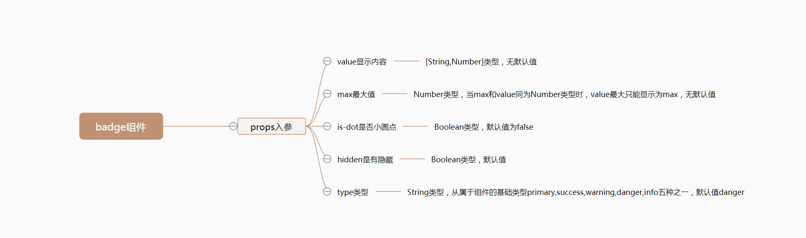

# Badge 标记

## 逻辑分析
`Badge`组件相对来说比较简单，只有几个`props`入参，经过整理，我们可以得到如下的思维导图：
 
 

## 组件开发
对于简单的`Badge`组件来说，我们直接一步到位，不需要拆分基础实现和完善。

### 准备

### 开发

## 组件文档

在以上`Badge`组件完善以后，我们将得到一个比较完整的星级评分组件，但仅仅只是有组件对我们来说并不是十分足够的，我们还需要撰写一份关于`Badge`组件的使用文档，组件文档结构按照以下内容来撰写：
* 用法：`Badge`组件的用法以及对应的案例。
* 属性：`Badge`组件每一个`props`属性的描述，包含类型，默认值以及说明。
 

`Badge`组件对应的文档地址为[Star组件文档](/components/base/badge#用法)，你可以点击这个地址查看更对内容。