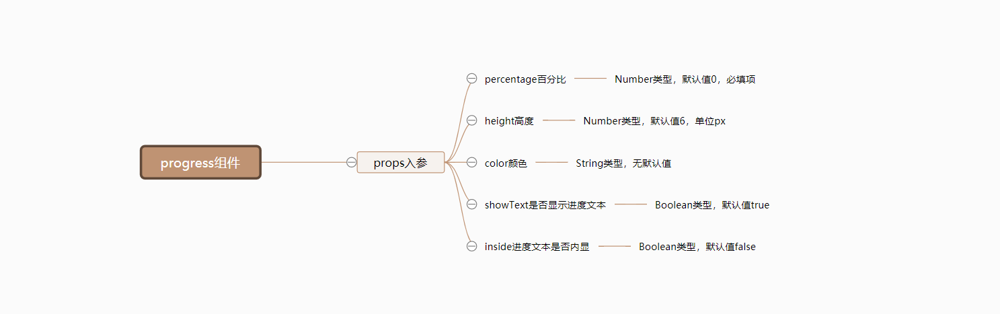
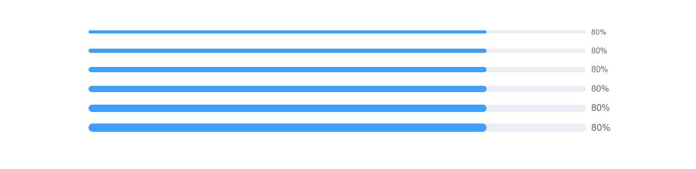
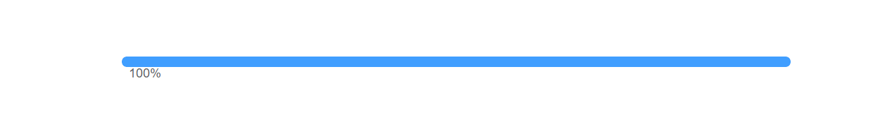
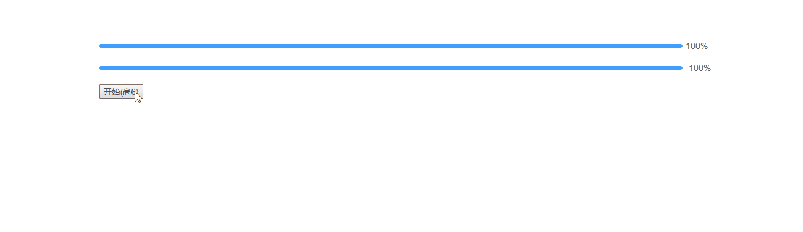

# Progress 进度条

## 逻辑分析
由于`Progress`进度条组件相对来说比较简单，只有几个`props`入参，所以我们整理后的思维导图如下：


## 组件开发
对于简单的`Progress`组件来说，我们直接一步到位，不需要拆分基础实现和完善。

### 准备
在`src/base`目录下新建`progress`目录，并在新建的`src/base/progress`目录中，再新建两个文件，分别是`index.js`和`progress.vue`。
```sh
# 新建 progress目录
$ mkdir progress

# 新建index.js和progress.vue文件
$ cd star
$ touch index.js
$ touch progress.vue
```
新建完毕后，`src/base`目录结构如下：
```sh
|-- base
|   |-- star
|   |   |-- index.js
|   |   |-- star.vue
|   |-- badge
|   |   |-- index.js
|   |   |-- badge.vue
|   |-- switch
|   |   |-- index.js
|   |   |-- switch.vue
|   |-- timeline
|   |   |-- index.js
|   |   |-- timeline.vue
|   |-- timeline-item
|   |   |-- index.js
|   |   |-- timeline-item.vue
|   |-- progress
|   |   |-- index.js
|   |   |-- progress.vue
```
同时我们为`progress.vue`文件，撰写以下基础代码：
::: warning
`progress`组件注册参考`Star`组件。
:::
```html
<template>
  <div class="mooc-progress">
    progress
  </div>
</template>
```
```js
<script>
export default {
  name: 'MoocProgress'
}
</script>
```

在以上步骤都正确完成后，我们在任意已经注册路由过的页面，使用`progress`组件，当出现`progress`文本内容即意味着`progress`组件已经全局注册成功了。

### 开发
根据上面的思维导图，我们列举`progress`组件的`props`入参：
* `percentage`：百分比。
* `height`：高度。
* `color`: 颜色。
* `showText`: 是否显示进度内容。
* `inside`: 进度内容是否内显。

`progress`组件的`html`结构如下：
```html
<div class="mooc-progress">
  <!-- bar -->
  <div
    ref="ProgressBar"
    class="mooc-progress-bar"
    :class="{
      'mooc-progress-bar-notext': !showText,
      'mooc-progress-bar-inside-text': inside
    }"
  >
    <div
      class="mooc-progress-bar-outer"
      :style="{
        height: `${height}px`
      }"
    >
      <div class="mooc-progress-bar-innter" :style="innerBarStyle">
        <div v-if="showText && inside" class="mooc-progress-bar-inner-text">
          {{ text }}
        </div>
      </div>
    </div>
  </div>

  <!-- text -->
  <div
    v-if="showText && !inside"
    ref="ProgressText"
    class="mooc-progress-text"
    :style="{
      'font-size': `${progressFontSize}px`
    }"
  >
    {{ text }}
  </div>
</div>
```

`progress`组件的`js`代码如下：
```js
export default {
  name: 'MoocProgress',
  props: {
    percentage: {
      type: Number,
      default: 0,
      required: true,
      validator (val) {
        return val >= 0 && val <= 100
      }
    },
    color: String,
    height: {
      type: Number,
      default: 6
    },
    showText: {
      type: Boolean,
      default: true
    },
    inside: {
      type: Boolean,
      default: false
    }
  },
  computed: {
    innerBarStyle () {
      return {
        'width': `${this.innerPercentage}%`,
        'background-color': this.color
      }
    },
    innerPercentage () {
      return Math.max(0, Math.min(this.percentage, 100))
    },
    progressFontSize () {
      return 12 + this.height * 0.4
    },
    text () {
      return `${this.innerPercentage}%`
    }
  }
}
```

**代码分析**：
* `percentage`：进度参数为必传参数，所以可以使用`required：true`进行限制。并且对于传递的`percentage`的值有要求：它们必须在`0-100`之间。这种验证形式当传递不合法的值(例如：`120`)会报错，但`percentage`的值依然是`120`，它依旧会反应在`text`内容上面，像下面这样，所以我们在内部又定义了一个计算属性`innerPercentage`，它主要作用依然是限制`percentage`的值必须在`0-100`之间。
::: tip
上为`el-progress`组件，下为`mooc-progress`组件。
:::


* `progressFontSize`: 当我们传递不同的`height`时，其对应的文字内容大小如果不一起跟随改动的话会显得不太合理，。所以定义一个`progressFontSize`的计算属性，让它根据传递的`height`来计算不同的字体大小，改动后的内容效果像下面这样：


### Bug修复
在`Element`的`progress`组件中，如果我们是线性进度条的话，会根据传递的`stroke-width`进行计算`font-size`的大小。而在其`css`样式文件中，有如下这样一段代码：
```css
@include b(progress-bar) {
  padding-right: 50px;
  margin-right: -55px;
}
```
当我们的进度文本内容宽度超过`50px`时，进度文本内容不会和进度条在同一条线上，下面是测试代码：
```html
<el-progress :percentage="100" :stroke-width="15"></el-progress>
```
测试结果：



基于以上问题，我们需要做一些改动：
* `listenObj`：新建`listenObj`计算属性，将可能对`font-size`影响的属性合并在一起，最后提供一个`watch`监听这个计算属性。当计算属性改变时，我们进行对应的计算。
```js
export default {
  // 省略其它部分
  computed: {
    listenObj () {
      return {
        percentage: this.percentage,
        height: this.height
      }
    }
  },
  methods: {
    progressBarDistrance () {
      console.log('font-size')
    }
  },
  watch: {
    listenObj () {
      this.$nextTick(() => {
        this.progressBarDistrance()
      })
    }
  }
}
```
* `progressBarDistrance`：在`progressBarDistrance`方法中，我们将进行一些计算。如果进度文本的宽度超过了我们制定的宽度的话，就改变其`margin-right`和`padding-right`的值，以达到让进度文本和进度条始终在一条线上。需要注意的时，当不显示进度文本或者进度文本内显示不需要做此处理。
```js
export default {
  // 省略其它部分
  computed: {
    listenObj () {
      return {
        percentage: this.percentage,
        height: this.height
      }
    }
  },
  methods: {
    progressBarDistrance () {
      // 当不显示进度内容 或者进度内容内显时不计算
      if (!this.showText || this.inside) {
        return
      }
      const baseDistance = 50
      const textMarginLeft = 10
      let textWidth = this.$refs.ProgressText.clientWidth
      let progressBar = this.$refs.ProgressBar
      let margin = baseDistance
      let padding = baseDistance
      if (textWidth + textMarginLeft > baseDistance) {
        margin = textWidth + textMarginLeft + 1
        padding = textWidth + textMarginLeft
      }

      progressBar.style.marginRight = `${-margin}px`
      progressBar.style.paddingRight = `${padding}px`
    }
  },
  watch: {
    listenObj () {
      this.$nextTick(() => {
        this.progressBarDistrance()
      })
    }
  }
}
```

处理完以上内容后，我们进行一下必要的测试工作，使用如下代码进行测试：
::: tip
上为`el-progress`组件，下为`mooc-progress`组件。
:::
```html
<el-progress :percentage="percentage" :stroke-width="height"></el-progress>
<mooc-progress :percentage="percentage" :height="height"></mooc-progress>

<button @click="handleStartClick">
  开始(高{{ height }})
</button>
```

```js
export default {
  data () {
    return {
      height: 6,
      percentage: 100
    }
  },
  methods: {
    handleStartClick () {
      this.timer = setInterval(() => {
        this.height++
        if (this.height >= 50) {
          clearInterval(this.timer)
        }
      }, 100)
    }
  }
}
```

测试结果如下：



## 未来计划
正如你所看到的那样，我们实现的`Progress`进度条组件还只是基于最基础的用法，目前不能支持其它使用场景。所以我们对进度条组件列举如下未来计划：
* 支持状态颜色。
* 支持区间颜色。
* 支持环形进度条。
* 支持仪表盘进度条。

## 组件文档
在以上`Progress`组件完善以后，我们将得到一个比较完整的进度条组件，但仅仅只是有组件对我们来说并不是十分足够的，我们还需要撰写一份关于`Progress`组件的使用文档，组件文档结构按照以下内容来撰写：
* 用法：`Progress`组件的用法以及对应的案例。
* 属性：`Progress`组件每一个`props`属性的描述，包含类型，默认值以及说明。
<br/>

`Progress`组件对应的文档地址为[Progress组件文档](/components/progress#用法)，你可以点击这个地址查看更对内容。