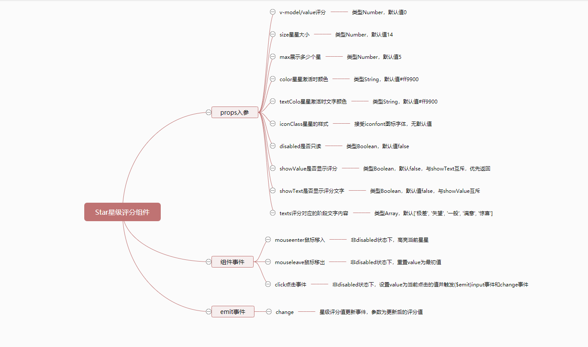

# Star 星级评分

## 逻辑分析
要整理`Star`组件的实现逻辑，我们从以下几个方面开始：
* `props`入参：对于每一个参数的类型，默认值以及描述。
* 组件`event`事件：组件自身的事件，例如`click`和`mouseenter`等等。
* 组件`$emit`事件：组件向父组件触发的事件，例如`change`事件。

根据以上的分类，我们使用[百度脑图](https://naotu.baidu.com/)，整理后的逻辑分析如下：
<br/>
<br/>


## 组件开发
根据以上逻辑分析，我们将`Star`组件分为两步来实现：
* 基础实现：先实现`Star`组件最主要的功能，例如`v-model/value`属性的实现。
* 组件完善：按思维导图，详细完善`Star`组件的相关逻辑。

### 准备
划分好实现步骤后，我们需要做一些前期的准备工作，按照我们在[准备](/guide/components/#开发规则)中提到的目录结构和规则，我们需要做以下步骤：

在`src/base`目录下新建`star`目录，并在新建的`src/base/star`目录中，再新建两个文件，分别是`index.js`和`star.vue`。
```sh
# 新建 star目录
$ mkdir star

# 新建index.js和star.vue文件
$ cd star
$ touch index.js
$ touch star.vue
```
新建完毕后，`src/base`目录结构如下
```sh
|-- base
|   |-- star
|   |   |-- index.js
|   |   |-- star.vue
```
同时我们为`star.vue`文件，撰写以下基础代码：
```html
<template>
  <div class="mooc-star">
    star
  </div>
</template>
```
```vue
<script>
export default {
  name: 'MoocStar'
}
</script>
```
为`index.js`撰写一下完整代码：
```js
import Star from './star.vue'

Star.install = function (Vue) {
  Vue.component(Star.name, Star)
}

export default Star
```

随后，我们需要在根目录下新建`register.js`文件(文件名任意)，并撰写以下代码：

```js
// 通过别名访问，可以在`vue.config.js`中配置。
import Star from 'base/star/index.js'

const components = [
  Star
]

const install = function (Vue) {
  components.forEach(component => {
    Vue.component(component.name, component)
  })
}

if (typeof window !== 'undefined' && window.Vue) {
  install(window.Vue)
}

export default {
  install, // 这个方法非常重要
  Star
}
```

最后我们需要在项目的入口文件`main.js`中，引入`register.js`文件，像下面这样：
```js
// ...省略其它部分
import Mooc from './register.js'
Vue.use(Mooc)

// ...省略其它部分
```

在以上步骤都正确完成后，我们在任意已经注册路由过的页面，使用`mooc-star`组件，当出现`star`文本内容即意味着`Star`组件已经全局注册成功了。

### 基础实现
::: tip
项目中使用到的图标字体为`iconfont`，请根据自己需要引入对应的字体。
:::
根据我们个人对于`Star`组件最主要的功能理解，我们将`props`属性和`event`事件做如下划分：

`props`入参：
* `value`：星级评分的分值。
* `max`：星星的数量。
* `color`：激活时星星的颜色。
* `disabled`：只读模式。
* `showValue`：是否显示评分内容。

`event`事件：
* `mouseenter`：鼠标移入事件。
* `mousenleave`：鼠标移出事件。
* `click`：鼠标点击事件。

根据以上划分，我们的基础`html`结构代码如下：
```html
<div class="mooc-star">
  <span
    v-for="n in max"
    :key="n"
    class="mooc-star-item"
    :class="{
      'is-disabled': disabled
    }"
  >
    <i
      class="iconfont iconxingxing"
      :style="{
        color: color
      }"
    ></i>
  </span>
  <span
    v-if="showValue"
    class="mooc-star-text">
    {{ text }}
  </span>
</div>
```
基础`javascript`代码如下：
```js
export default {
  name: 'MoocStar',
  props: {
    value: {
      type: Number,
      default: 0
    },
    max: {
      type: Number,
      default: 5
    },
    color: {
      type: String,
      default: '#ff9900'
    },
    showValue: {
      type: Boolean,
      default: false
    },
    disabled: {
      type: Boolean,
      default: false
    }
  },
  data () {
    return {
      currentValue: this.value
    }
  },
  computed: {
    text () {
      let result = ''
      if (this.showValue) {
        result = this.currentValue
      }
      return result
    }
  }
}
</script>
```

实现以上基础代码后，在没有撰写任何`css`的情况下，我们可以得到如下图所示的结果：


紧接着，我们来撰写必要的`css`：
::: tip
我们把`Star`组件中关于变量的定义全部放在`src/assets/theme/src/star-variables.styl`文件中，如果你没有此文件，需要新建。
:::

`Star`组件中定义的变量如下：
```stylus
$star-item-margin-right = 6px;
$star-icon-hover-scale  = 1.15;
$star-icon-transition-duration = 0.3s;
$star-text-padding-left = 5px;
$star-text-font-size = 14px;
```
`Star`组件基础`css`代码：
```stylus
@import '~assets/theme/src/star-variables.styl';
.mooc-star
  display: inline-block;
  .mooc-star-item, .mooc-star-text
    display: inline-block;
    vertical-align: middle;
  .mooc-star-item
    margin-right: $star-item-margin-right;
    cursor: default;
    &:last-child
      margin-right: 0;
    &.is-disabled
      pointer-events: none;
    &:not(.is-disabled)
      cursor: pointer;
      .iconfont
        display: inline-block;
        transition: all $star-icon-transition-duration;
      &:hover
        .iconfont
          transform: scale($star-icon-hover-scale);
  .mooc-star-text
    padding-left: $star-text-padding-left;
    font-size: $star-text-font-size;
```

接下来，我们来实现上面提到的事件：
<br/>
`html`结构改动：
```html {9,10,11,16}
<div class="mooc-star">
  <span
    v-for="n in max"
    :key="n"
    class="mooc-star-item"
    :class="{
      'is-disabled': disabled
    }"
    @mouseenter="handleMouseEnter(n)"
    @mouseleave="handleMouseLeave"
    @click="handleStarClick(n)"
  >
    <i
      class="iconfont iconxingxing"
      :style="{
        color: getIconColor(n)
      }"
    ></i>
  </span>
  <span
    v-if="showValue"
    class="mooc-star-text">
    {{ text }}
  </span>
</div>
```

`javascript`改动部分：
```js
export default {
  // ...省略其它部分
  methods: {
    handleMouseEnter (val) {
      if (this.disabled) {
        return
      }
      this.currentValue = val
    },
    handleMouseLeave () {
      if (this.disabled) {
        return
      }
      this.currentValue = this.value
    },
    handleStarClick (val) {
      if (this.disabled) {
        return
      }
      this.currentValue = val
      this.$emit('change', val)
      this.$emit('input', val)
    },
    getIconColor (val) {
      return val <= this.currentValue ? this.color : '#eee'
    }
  }
}
```

最后我们在任意测试页面来测试一下`Star`组件，使用如下方式进行基础测试：
```html
<div class="home">
  <mooc-star v-model="starVal"></mooc-star>
  {{starVal}}
</div>
```

```js
export default {
  data () {
    return {
      starVal: 3
    }
  }
}
```
测试结果如下：


### 组件完善
`Star`组件实现了基础功能后就完成了我们预定的`Star`组件大部分功能，接下来我们将对`Star`组件进一步完善。

`props`入参：
* `size`: 星级评分的大小。
* `texts`: 评分的内容。
* `showText`: 是否显示评分的内容。
* `textColor`: 评分内容的颜色。

完善后的`html`代码(改动为高亮部分)：
```html {14,15,16,17,18,19,23,24,25,26,27,28}
<div class="mooc-star">
  <span
    v-for="n in max"
    :key="n"
    class="mooc-star-item"
    :class="{
      'is-disabled': disabled
    }"
    @mouseenter="handleMouseEnter(n)"
    @mouseleave="handleMouseLeave"
    @click="handleStarClick(n)"
  >
    <i
      class="iconfont iconxingxing"
      :class="iconClass"
      :style="{
        'font-size': `${ size }px`,
        'color': getIconColor(n)
      }"
    ></i>
  </span>
  <span
    v-if="showValue || showText"
    class="mooc-star-text"
    :style="{
      'color': textColor,
      'font-size': `${ size }px`
    }"
  >
    {{ text }}
  </span>
</div>
```
完善后的`javascript`代码如下(仅改动部分)：
```js
export default {
  // ... 省略其它部分
  props: {
    size: {
      type: Number,
      default: 14
    },
    textColor: {
      type: String,
      default: '#ff9900'
    },
    showText: {
      type: Boolean,
      default: false
    },
    texts: {
      type: Array,
      default () {
        return ['极差', '失望', '一般', '满意', '惊喜']
      }
    },
    iconClass: String
  },
  computed: {
    text () {
      let result = ''
      if (this.showValue) {
        result = this.currentValue
      } else if (this.showText) {
        result = this.texts[this.currentValue - 1]
      }
      return result
    }
  }
}
```

在我们完善`Star`组件后，我们需要进行一些必要的测试工作，我们使用如下的代码来进行测试：
```html
<div class="home">
  <mooc-star
    v-model="starVal"
    :size="30"
    icon-class="iconbanxing"
    :show-text="true"
  ></mooc-star>
</div>
```
```js
export default {
  name: 'home',
  data () {
    return {
      starVal: 3
    }
  }
}
```

测试结果如下图所示：


## 未来计划
正如你所看到的那样，虽然我们支持`v-model`，但并不支持表单，也同样不支持半星等等问题，因为我们是以业务为导向，根据业务来逐步完善我们代码的，所以我们对未来做了一些`Star`组件的迭代计划：
1. 支持`form`表单。
2. 支持半星。
3. 支持未激活时，星星的颜色。
4. 支持未激活时，文字的颜色。

## 组件文档
在以上`Star`组件完善以后，我们将得到一个比较完整的星级评分组件，但仅仅只是有组件对我们来说并不是十分足够的，我们还需要撰写一份关于`Star`组件的使用文档，组件文档结构按照以下内容来撰写：
* 用法：`Star`组件的用法以及对应的案例。
* 属性：`Star`组件每一个`props`属性的描述，包含类型，默认值以及说明。
* 事件：`Star`组件相关的事件说明以及对应的案例。
<br/>

`Star`组件对应的文档地址为[Star组件文档](/components/star#用法)，你可以点击这个地址查看更对内容。