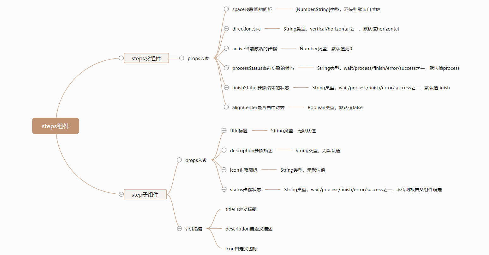

# Steps 步骤条

## 逻辑分析
`Steps`步骤组件由`steps`父组件以及`step`子组件共同构成，这样划分可以让组件之间解耦，根据我们对于`steps`步骤组件的整理，可以得到如下的思维导图：


## 组件开发

### 准备
在`src/base`目录下新建`steps`目录，并在新建的`src/base/steps`目录中，再新建两个文件，分别是`index.js`和`steps.vue`。
```sh
# 新建 steps目录
$ mkdir steps

# 新建index.js和steps.vue文件
$ cd star
$ touch index.js
$ touch steps.vue
```
新建完毕后，`src/base`目录结构如下：
```sh
|-- base
|   |-- star
|   |   |-- index.js
|   |   |-- star.vue
|   |-- badge
|   |   |-- index.js
|   |   |-- badge.vue
|   |-- switch
|   |   |-- index.js
|   |   |-- switch.vue
|   |-- timeline
|   |   |-- index.js
|   |   |-- timeline.vue
|   |-- timeline-item
|   |   |-- index.js
|   |   |-- timeline-item.vue
|   |-- progress
|   |   |-- index.js
|   |   |-- progress.vue
|   |-- steps
|   |   |-- index.js
|   |   |-- steps.vue
```
同时我们为`steps.vue`文件，撰写以下基础代码：
```html
<div class="mooc-steps">
  <slot></slot>
</div>
```
```js
export default {
  name: 'MoocSteps'
}
```

然后在`src/base`目录下新建`step`目录，并在新建的`src/base/step`目录中，再新建两个文件，分别是`index.js`和`step.vue`。
```sh
# 新建 step目录
$ mkdir step

# 新建index.js和step.vue文件
$ cd step
$ touch index.js
$ touch step.vue
```
新建完毕后，`src/base`目录结构如下：
```sh
|-- base
|   |-- star
|   |   |-- index.js
|   |   |-- star.vue
|   |-- badge
|   |   |-- index.js
|   |   |-- badge.vue
|   |-- switch
|   |   |-- index.js
|   |   |-- switch.vue
|   |-- timeline
|   |   |-- index.js
|   |   |-- timeline.vue
|   |-- timeline-item
|   |   |-- index.js
|   |   |-- timeline-item.vue
|   |-- progress
|   |   |-- index.js
|   |   |-- progress.vue
|   |-- steps
|   |   |-- index.js
|   |   |-- steps.vue
|   |-- step
|   |   |-- index.js
|   |   |-- step.vue
```
同时我们为`step.vue`文件，撰写以下基础代码：
```html
<div class="mooc-step">
  step
</div>
```
```js
export default {
  name: 'MoocStep'
}
```


在以上步骤都正确完成后，我们在任意已经注册路由过的页面，使用如下代码使用`Steps`组件，当出现`step`文本内容即意味着`steps`和`step`组件已经全局注册成功了。
```html
<mooc-steps>
  <mooc-step></mooc-step>
</mooc-steps>
```

### steps父组件开发

### step子组件开发

### 组件测试

## 组件文档
在以上`Steps`组件完善以后，我们将得到一个比较完整的步骤组件，但仅仅只是有组件对我们来说并不是十分足够的，我们还需要撰写一份关于`Steps`组件的使用文档，组件文档结构按照以下内容来撰写：
* 用法：`Steps`组件的用法以及对应的案例。
* 属性：`Steps`组件每一个`props`属性的描述，包含类型，默认值以及说明。
<br/>

`Steps`组件对应的文档地址为[Steps组件文档](/components/steps#用法)，你可以点击这个地址查看更对内容。