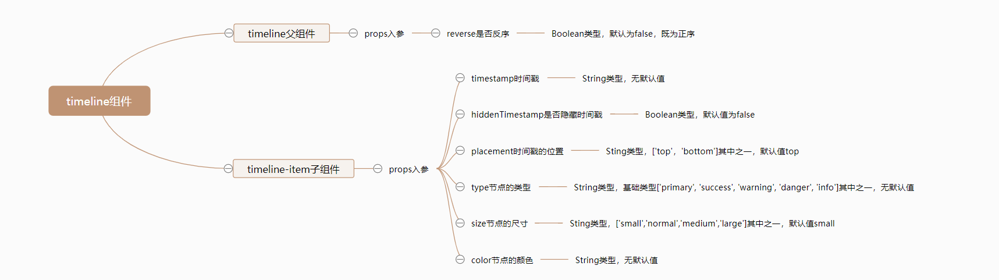
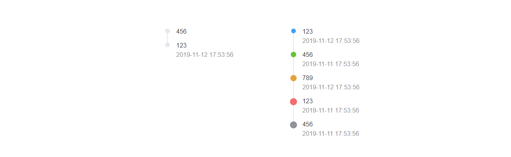

# Timeline 时间线

## 逻辑分析
由于`Timeline`时间线组件相对来说比较简单，只有几个`props`入参，所以我们整理后的思维导图如下：



## 组件开发
对于简单的`Timeline`组件来说，我们直接一步到位，不需要拆分基础实现和完善。

### 准备
在以上思维导图整理完毕后，我们需要做一些前期的准备工作，按照我们在[准备](/guide/components/#开发规则)中提到的目录结构和规则，我们需要做以下步骤：

在`src/base`目录下新建`timeline`目录，并在新建的`src/base/timeline`目录中，再新建两个文件，分别是`index.js`和`timeline.vue`。
```sh
# 新建 timeline目录
$ mkdir timeline

# 新建index.js和timeline.vue文件
$ cd star
$ touch index.js
$ touch timeline.vue
```
新建完毕后，`src/base`目录结构如下：
```sh
|-- base
|   |-- star
|   |   |-- index.js
|   |   |-- star.vue
|   |-- badge
|   |   |-- index.js
|   |   |-- badge.vue
|   |-- switch
|   |   |-- index.js
|   |   |-- switch.vue
|   |-- timeline
|   |   |-- index.js
|   |   |-- timeline.vue
```
同时我们为`timeline.vue`文件，撰写以下基础代码：
::: warning
`timeline`组件注册参考`Star`组件。
:::
```html
<template>
  <div class="mooc-timeline">
    <slot></slot>
  </div>
</template>
```
```js
<script>
export default {
  name: 'MoocTimeline'
}
</script>
```

然后在`src/base`目录下新建`timeline-item`目录，并在新建的`src/base/timeline-item`目录中，再新建两个文件，分别是`index.js`和`timeline-item.vue`。
```sh
# 新建 timeline-item目录
$ mkdir timeline-item

# 新建index.js和timeline-item.vue文件
$ cd timeline-item
$ touch index.js
$ touch timeline-item.vue
```
新建完毕后，`src/base`目录结构如下：
```sh
|-- base
|   |-- star
|   |   |-- index.js
|   |   |-- star.vue
|   |-- badge
|   |   |-- index.js
|   |   |-- badge.vue
|   |-- switch
|   |   |-- index.js
|   |   |-- switch.vue
|   |-- timeline
|   |   |-- index.js
|   |   |-- timeline.vue
|   |-- timeline-item
|   |   |-- index.js
|   |   |-- timeline-item.vue
```
同时我们为`timeline-item.vue`文件，撰写以下基础代码：
::: warning
`timeline-item`组件注册参考`Star`组件。
:::
```html
<template>
  <div class="mooc-timeline-item">
    timeline
  </div>
</template>
```
```js
<script>
export default {
  name: 'MoocTimelineItem'
}
</script>
```

在以上步骤都正确完成后，我们在任意已经注册路由过的页面，使用如下代码使用`timeline`组件，当出现`timeline`文本内容即意味着`timeline`和`timeline-item`组件已经全局注册成功了。
```html
<mooc-timeline>
  <mooc-timeline-item></mooc-timeline-item>
</mooc-timeline>
```

### Timeline开发
根据以上思维导图，我们发现`timeline`父组件只有一个`props`属性，所以我们可以使用`render`的方式来渲染。
::: tip
使用`render`方式渲染，就不需要再写`template`部分。
:::
`timeline`父组件的`js`代码如下：
```js
export default {
  name: 'MoocTimeline',
  props: {
    reverse: {
      type: Boolean,
      default: false
    }
  },
  render () {
    let reverse = this.reverse
    let slots = this.$slots.default || []
    let classs = {
      'mooc-timeline': true
    }
    if (reverse) {
      slots = slots.reverse()
    }

    return (
      <ul class={ classs }>
        { slots }
      </ul>
    )
  }
}
```
`timeline`父组件的`css`代码如下：
```stylus
.mooc-timeline
  list-style: none;
```

**代码分析**：
* `render`：除了我们常见的`template`方式撰写组件以外，我们还可以使用`render`方式去渲染。二者区别在于：`render`函数不会再像`template`一样走模板编译过程，其中`render`部分的书写格式是`JSX`方式，你可以通过查看官网[Render渲染函数](https://cn.vuejs.org/v2/guide/render-function.html)阅读更多关于`render`的内容。
* `reverse`：根据`reverse`的值，又因为`slots`是一个数组，所以我们可以使用`slots.reverse`进行节点内容的反转，从而达到让`timeline`时间线组件按正序或者反序排列的目的。

### TimelineItem开发
根据上面的思维导图，我们列举`timeline-item`子组件的`props`入参：
* `timestamp`：时间戳。
* `hide-timestamp`：是否隐藏时间戳。
* `placement`: 时间戳的位置。
* `color`: 节点的颜色。
* `size`: 节点的大小。
* `type`: 节点的类型。

`timeline-item`子组件的`html`结构如下：
```html
<div class="mooc-timeline-item">
  <!-- line -->
  <div class="mooc-timeline-item-line"></div>

  <!-- dot -->
  <div
    v-if="!$slots.dot"
    class="mooc-timeline-item-dot"
    :style="{
      'background-color': color
    }"
    :class="[
      type && `mooc-timeline-item-dot-${type}`,
      size && `mooc-timeline-item-dot-${size}`
    ]"
  ></div>
  <div v-else class="mooc-timeline-item-dot-customer">
    <slot name="dot"></slot>
  </div>

  <!-- content -->
  <div class="mooc-timeline-item-wrapper">
    <div
      v-if="!hideTimestamp && placement == 'top'"
      class="mooc-timeline-item-timestamp is-top"
    >
      {{ timestamp }}
    </div>
    <div class="mooc-timeline-item-content">
      <slot></slot>
    </div>
    <div
      v-if="!hideTimestamp && placement == 'bottom'"
      class="mooc-timeline-item-timestamp is-bottom"
    >
      {{ timestamp }}
    </div>
  </div>
</div>
```

`timeline-item`子组件的`js`代码如下：
```js
// baseType是组件的基础类型：['primary', 'success', 'warning', 'danger', 'info']
import { baseType } from 'assets/js/mooc.config.js'
export default {
  name: 'MoocTimelineItem',
  props: {
    timestamp: String,
    hideTimestamp: {
      type: Boolean,
      default: false
    },
    placement: {
      type: String,
      default: 'bottom',
      validator (val) {
        return ['top', 'bottom'].includes(val)
      }
    },
    color: String,
    type: {
      type: String,
      validator (val) {
        return baseType.includes(val)
      }
    },
    size: {
      type: String,
      default: 'small',
      validator (val) {
        return ['small', 'normal', 'medium', 'large'].includes(val)
      }
    }
  }
}
```

在撰写完以上`html`结构和`js`代码后，我们来处理组件的`css`：
::: tip
我们把`Timeline`组件中关于变量的定义全部放在`src/assets/theme/src/timeline-variables.styl`文件中，如果你没有此文件，需要新建。
:::

`timeline-itme`子组件中定义的变量如下：
```stylus
$timeline-item-padding-bottom = 20px
$timeline-item-line-left = 4px
$timeline-item-border-left-size = 2px
$timeline-item-border-left-style = solid
$timeline-item-small-left = 1px
$timeline-item-small-size = 12px
$timeline-item-status-args = small normal medium large
$timeline-item-type-args = primary success warning danger info
$timeline-item-wrapper-padding-left = 28px
$timeline-item-content-line-height = 1
$timeline-item-timestamp-margin = 8px
```
`timeline-item`子组件的`css`样式代码如下：
```stylus
@import '~assets/theme/variables.styl';
@import '~assets/theme/src/timeline-variables.styl';
@import '~assets/theme/mixin/timeline-mixin.styl';
.mooc-timeline-item
  position: relative;
  padding-bottom: $timeline-item-padding-bottom;
  &:last-child
    .mooc-timeline-item-line
      display: none;
  .mooc-timeline-item-line
    position: absolute;
    left: $timeline-item-line-left;
    top: 0;
    height: 100%;
    border-left: $timeline-item-border-left-size $timeline-item-border-left-style $base-border-second-color;
  .mooc-timeline-item-dot
    position: absolute;
    top: 0;
    border-radius: $base-border-radius-circle;
    background-color: $base-border-second-color;
    timeline-status($timeline-item-small-left, $timeline-item-small-size, $timeline-item-status-args);
    timeline-type($timeline-item-type-args, $base-primary $base-success $base-warning $base-danger $base-info);
    &-customer
      position: absolute;
      display: flex;
      justify-content: center;
      align-items: center;
  .mooc-timeline-item-wrapper
    position: relative;
    top: 0;
    padding-left: $timeline-item-wrapper-padding-left;
    .mooc-timeline-item-content
      line-height: $timeline-item-content-line-height;
      color: $base-font-first-color;
    .mooc-timeline-item-timestamp
      color: $base-info
      line-height: $timeline-item-content-line-height;
      &.is-top
        margin-bottom: $timeline-item-timestamp-margin;
      &.is-bottom
        margin-top: $timeline-item-timestamp-margin;
```

在以上样式中我们使用了两个`mixin`方法，它们定义在`src/assets/theme/mixin/timeline-mixin.styl`，代码如下：
::: tip
如果你对于`stylus`语法还不是特别熟悉的话，你可以点击[Stylus官网](https://stylus.bootcss.com/)，还可以点击[Stylus中文文档](https://www.zhangxinxu.com/jq/stylus/)来学习更多内容。
:::
```stylus
timeline-status($left, $size, $args)
  for size, index in $args
    &-{size}
      left: unit(- ($left + index ), 'px');
      width: unit($size + index * 2, 'px');
      height: @width;

timeline-type($types, $colors)
  for type, index in $types
    &-{type}
      background-color: $colors[index]
```
如果你对以上`mixin`的形式还不是特别敏感的话，我们来看看没有使用`mixin`之前的部分代码：
```stylus
/* 省略部分代码 */
@import '~assets/theme/variables.styl';
@import '~assets/theme/src/timeline-variables.styl';
.mooc-timeline-item
  &-dot
    position: absolute;
    top: 0;
    border-radius: 50%;
    background-color: $timeline-item-dot-color;
    &-small
      left: -1px;
      width: $timeline-item-dot-small-size;
      height: $timeline-item-dot-small-size;
    &-normal
      left: -2px;
      width: $timeline-item-dot-normal-size;
      height: $timeline-item-dot-normal-size;
    &-medium
      left: -3px
      width: $timeline-item-dot-medium-size;
      height: $timeline-item-dot-medium-size;
    &-large
      left: -4px
      width: $timeline-item-dot-large-size;
      height: $timeline-item-dot-large-size;
    &-primary
      background-color: $base-primary;
    &-success
      background-color: $base-success;
    &-warning
      background-color: $base-warning;
    &-danger
      background-color: $base-danger;
    &-info
      background-color: $base-info;
```
我们可以看到，`size`和`type`部分的样式代码大多是类似，但缺占据了很大的篇幅撰写，使用`mixin`方式后可以大大减少我们的代码撰写量。

### 组件测试
在写完以上`timeline`父组件和`timeline-item`子组件以后，我们需要对它们进行必要的测试，测试代码如下：
```html
<mooc-timeline reverse>
  <mooc-timeline-item timestamp="2019-11-12 17:53:56">123</mooc-timeline-item>
  <mooc-timeline-item hide-timestamp placement="top" timestamp="2019-11-11 17:53:56">456</mooc-timeline-item>
</mooc-timeline>
<mooc-timeline>
  <mooc-timeline-item size="small" type="primary" timestamp="2019-11-12 17:53:56">123</mooc-timeline-item>
  <mooc-timeline-item size="normal" type="success" timestamp="2019-11-11 17:53:56">456</mooc-timeline-item>
  <mooc-timeline-item size="medium" type="warning" timestamp="2019-11-12 17:53:56">789</mooc-timeline-item>
  <mooc-timeline-item size="large" type="danger" timestamp="2019-11-11 17:53:56">123</mooc-timeline-item>
  <mooc-timeline-item size="large" type="info" timestamp="2019-11-11 17:53:56">456</mooc-timeline-item>
</mooc-timeline>
```

测试结果如下：


## 组件文档

在以上`Timeline`组件完善以后，我们将得到一个比较完整的时间线组件，但仅仅只是有组件对我们来说并不是十分足够的，我们还需要撰写一份关于`Timeline`组件的使用文档，组件文档结构按照以下内容来撰写：
* 用法：`Timeline`组件的用法以及对应的案例。
* 属性：`Timeline`组件每一个`props`属性的描述，包含类型，默认值以及说明。
<br/>

`Timeline`组件对应的文档地址为[Timeline组件文档](/components/timeline#用法)，你可以点击这个地址查看更对内容。