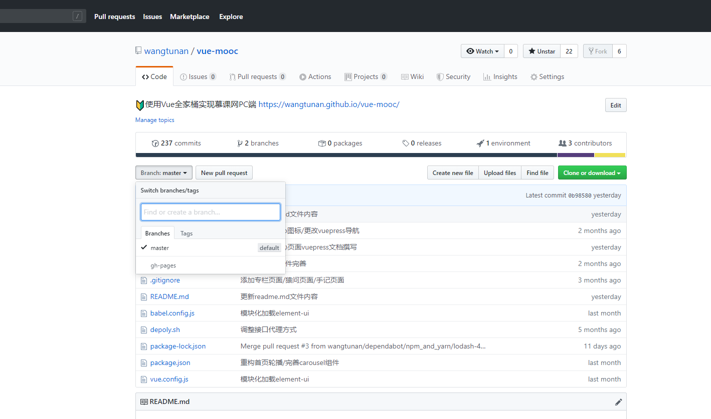

# 自动化部署
因为`vue-mooc`是发布在`Github Pages`上，所以我们所说的自动化部署是部署到`Github Pages`上，而非自有服务器或者云服务器。

以`vue-mooc`项目为例，其`Github`仓库地址为`https://wangtunan.github.io/vue-mooc/`。我们首先需要在此仓库新建一个`gh-pages`分支，如下图所示：


随后我们需要在`vue-mooc`项目根目录新建一个`depoly.sh`的脚本：
```sh
# vue-mooc根目录新建depoly.sh
$ touch depoly.sh
```

新建完毕后，我们需要在`depoly.sh`文件中输入一点代码：
```sh
# 以vue-mooc项目为例，你可以替换成自己项目的仓库地址
# 确保脚本抛出遇到的错误
set -e

# 生成静态文件
npm run build

# 进入生成的文件夹
cd dist

# git提交流程
git init
git add -A
git commit -m 'depoly脚本更新'
git remote add origin https://github.com/wangtunan/vue-mooc.git
git config user.name 'wangtunan'
git config user.email 'why583440138@gmail.com'
git push -f origin master:gh-pages
```
::: warning 注意
需要注意的是，我们在`vue.config.js`文件中对于`publicPath`配置的路径不是默认的`/`。
:::
```js {8}
const path = require('path')

function resolve (dir) {
  return path.join(__dirname, dir)
}
module.exports = {
  // 注意这里
  publicPath: './',
  outputDir: 'dist',
  configureWebpack: {
    resolve: {
      alias: {
        '@': resolve('src'),
        'api': resolve('src/api'),
        'assets': resolve('src/assets'),
        'base': resolve('src/base'),
        'components': resolve('src/components'),
        'pages': resolve('src/pages'),
        'utils': resolve('src/utils'),
        'router': resolve('src/router')
      }
    }
  },
  productionSourceMap: true,
  devServer: {
    port: 3400,
    proxy: {
      '/mock': {
        target: 'http://localhost:3400'
      }
    }
  },
  lintOnSave: true
}
```

在撰写完以上代码后，我们可以通过直接点击`depoly.sh`文件来执行自动化发布命令。但如果我们习惯了命令式的话，我们需要在`package.json`文件中新增一个`script`命令：
```json {7}
"scripts": {
  "serve": "vue-cli-service serve",
  "build": "vue-cli-service build",
  "lint": "vue-cli-service lint",
  "docs:dev": "vuepress dev docs",
  "docs:build": "vuepess build docs",
  "depoly": "depoly.sh"
}
```

命令新增完毕后，我们可以运行如下命令来运行`depoly.sh`脚本：
```sh
$ npm run depoly
```