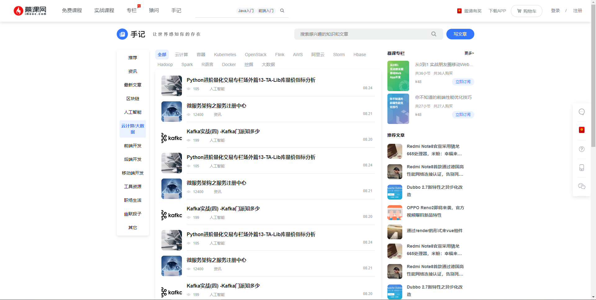

# 手记
::: tip
目录`src/pages/article`
:::
`vue-mooc`中的手记部分相对于真实慕课网中的手记，做了一些稍微的改动：
* 移除了一些不必要的广告部分。
* 因为某些原因去掉了手记详情页面。

## 手记列表

在开发手记列表之前，我们同样需要弄清楚我们基本的`html`结构：
* `header`：放置手记的`banner`图片和搜索等信息。
* `content`：采用左、中、右三栏布局。左侧手记分类，中间显示手记列表，右侧显示推荐专栏、推荐手记和推荐作者。

在划分完以上基本的`html`结构以后，我们来实现以下基础的布局：
```html
<div class="article">
  <!-- 头部 -->
  <div class="article-header"></div>

  <!-- 内容部分 -->
  <div class="article-content">
    <div class="nav"></div>
    <div class="list"></div>
    <div class="recommend"></div>
  </div>
</div>
```
与专栏列表一样，手记列表相对来说内容较少，布局也比较简单。所以我们并不会一步一步的讲述如何撰写`css`等方面的内容。<br/>

唯一一个方面值得一提的是，我们会根据左侧选择的手记类型，过滤手记列表页的数据。定义两个计算属性，其中`filterList`是手记列表的标签筛选列表，`list`为手记列表。
```js
export default {
  // 省略其它
  computed: {
    filterList () {
      let currentNav = this.navList[this.currentNavIndex]
      return currentNav ? currentNav.data : []
    },
    list () {
      let currentNav = this.navList[this.currentNavIndex]
      let articleList = this.articleList      
      if (!currentNav || !articleList.data) {
        return
      }
      const type = currentNav.type
      const list = articleList.data.slice()
      return list.filter(item => item.type === type)
    }
  }
}
```
处理完以上两个计算属性后，我们随后需要把文章列表单独提取为一个组件，名为`article-list.vue`，`html`代码如下：
```html
<div class="article-list">
  <!-- 筛选部分 -->
  <dl v-if="filterList" class="list-filter">
    <dd
      v-for="(filter,index) in filterList"
      :key="index"
      class="filter-item"
      :class="{active: currentIndex==index}"
      @click="currentIndex=index"
    >
      {{ filter }}
    </dd>
  </dl>

  <!-- 列表部分 -->
  <ul class="list-content">
    <li v-for="(item,index) in list" :key="index" class="list-item">
      <div class="img-box">
        
      </div>
      <div class="content">
        <p class="title">
          {{ item.title }}
        </p>
        <p class="information">
          <span class="iconfont">&#xe681;</span>
          <span class="number">{{ item.view }}</span>
          <span class="name">{{ item.name }}</span>
          <span class="tag">{{ item.tag }}</span>
          <span class="time">{{ item.time }}</span>
        </p>
      </div>
    </li>
  </ul>

  <!-- 分页 -->
  <pagination :total.sync="total" />
</div>
```
`javascript`代码如下：
```js
import Pagination from 'components/pagination/pagination.vue'
export default {
  props: {
    list: {
      type: Array,
      default () {
        return []
      }
    },
    filterList: {
      type: Array,
      default () {
        return []
      }
    }
  },
  data () {
    return {
      total: 100,
      currentIndex: 0
    }
  },
  watch: {
    filterList () {
      this.currentIndex = 0
    }
  },
  components: {
    Pagination
  }
}
```
定义完`article-list.vue`文件后，我在手记列表页面引用它，并给其传值：
```html
<article-list v-if="list && list.length" :filter-list="filterList" :list="list" />
```

在做完以上内容后，我们通过点击左侧的手记分类，来观察我们实现的`article-list.vue`的实际效果：
<br/>



## 推荐手记
::: tip
目录`src/component/recommend/recommend-article`。
:::
在手记页面的右侧出现了推荐手记的部分内容，而这部分内容也可能在其它地方同样出现，所以我们把它提取为业务公共组件，放置在`components`目录。<br/>
根据我们的理解，我们对`recommend-article`组件的梳理如下：
`props`入参：
* `title`：推荐手记的标题，`String`类型。
* `list`: 推荐手记列表数据，`Array`类型。

根据以上梳理，我们可以得到以下基础代码：
```html
<div class="recommend">
  <h3 class="recommend-title">
    {{ title }}
  </h3>
  <ul>
    <li v-for="(item,index) in list" :key="index" class="recommend-item">
      <div class="img-box">
        
      </div>
      <div class="recommend-content">
        <p class="title">
          {{ item.title }}
        </p>
      </div>
    </li>
  </ul>
</div>
```
基础`javascript`代码：
```js
export default {
  props: {
    title: {
      type: String,
      default: ''
    },
    list: {
      type: Array,
      default () {
        return []
      }
    }
  }
}
```