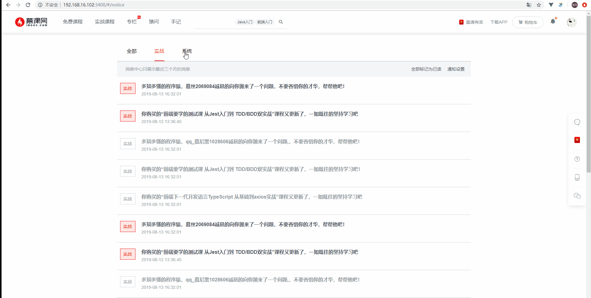

# 消息中心
::: tip
目录`src/pages/notice`
:::
`vue-mooc`中的消息中心，相对于真实慕课网的消息中心稍微有一点不同，主要体现在：
* 通知：通知部分我们拆分成了**全部**、**实战**和**系统**三个选项卡。
* 私信：`vue-mooc`去除了私信功能，暂不开发。
<br/>

在消息中心页面中我们将分为两个小节，第一节介绍消息列表的开发，第二小节介绍消息弹窗的开发，在开发之前我们先来看一下**消息中心**完成后的实际效果：
<br/>



在消息中心页面，我们使用到的基础组件有：
* [mooc-switch开关组件](/guide/components/switch)，此组件对应`el-switch`。
* [mooc-button按钮组件](/guide/components/button)，此组件对应`el-button`。
* [mooc-dialog弹窗组件](/guide/components/dialog)，此组件对应`el-dialog`。
* [mooc-divider分割线组件](/guide/components/divider)，此组件对应`el-divider`。

你可以点击以上链接，查看以上基础组件是如何封装的，同时你又可以在其对应组件的实现部分找到此组件对应的组件文档地址。

## 消息列表

在消息列表页中，我们将分为三块`DOM`区域来说明，第一块为选项卡部分，第二块为列表部分，最后一块是分页部分，类似如下的`html`结构：
```html
<div class="notice">
  <!-- nav -->
  <ul class="notice-nav"></ul>
  <!-- list -->
  <div class="notice-list"></div>
  <!-- pagination -->
  <pagination :total="total" :page.sync="page" />
</div>
```
在划分外比较清晰的`html`结构后，我们需要编写必要的`javascript`和`css`以及完善各个部分的`html`结构。在编写消息中心代码的过程中，有几个需要注意的地方。
* **接口请求**：按照[Mock数据](/guide/basic/mock)中提到的那样，我们本地开发使用了请求本地`json`文件的形式。关于消息中心的两个`json`文件目录为`public/mock/notice`，同时我们需要在`src/api/notice.js`中撰写我们的请求接口，完整的代码如下：
```js
import axios from 'utils/axios.js'
// 获取中心列表
export function getNoticeList () {
  return axios.get('/mock/notice/notice.json')
}
// 获取消息中心设置
export function getNoticeSetting () {
  return axios.get('/mock/notice/setting.json')
}
```
* **选项卡切换**：由于选项卡切换会与列表数据有一定的联动效果，我们定义了一个`filterList`的计算属性，其作用是在全部消息中筛选出当前选项卡类型的数据。
```js
export default {
  // 省略其它部分
  computed: {
    filterList () {
      let result = this.noticeList.slice()
      const code = this.navList[this.currentNavIndex].code
      if (this.currentNavIndex !== 0) {
        result = result.filter(item => item.code === code)
      }
      return result
    }
  }
}
```
* **更好的动画效果**：你可能已经看到了，在消息列表中我们有一个删除消息的功能。为了更好的提升用户体验，当用户点击删除当前条的消息时，我们需要添加一定的动画交互，让用户的操作现得不那么僵硬。另外需要注意，因为我们在代码中使用到了定时器，所以需要在组件销毁的生命周期中去清空这个定时器，这是一个极好的开发习惯。
```js
export default {
  methods: {
    handleDeleteClick (item, index) {
      clearTimeout(this.timer)
      let currentDeleteItem = this.$refs.NoticeList[index]
      currentDeleteItem.style.height = 0
      currentDeleteItem.style.opacity = 0
      this.timer = setTimeout(() => {
        currentDeleteItem.style.display = 'none'
        this.noticeList.splice(index, 1)
        this.$message.success('删除成功')
      }, 300)
    }
  },
  beforeDestroy () {
    // 始终在组件销毁的生命周期中清空定时器是一个极好的开发习惯
    clearTimeout(this.timer)
  }
}
```
在列表的样式中添加一定的过度动画效果(实际动画效果请观看本页gif动画)
```css
.list-item
  transition: all 0.3s linear;
  opacity: 1;
```

## 消息弹窗
::: tip
目录`src/pages/notice/notice-setting.vue`
:::
消息弹窗的实质是包裹着的一层`dialog`弹窗，我们认为将稍微有一点代码量的`dialog`弹窗单独封装成一个组件是可取的。

### 善用异步加载
当进入到**消息中心**页面的时候，我们并不会马上请求通知消息配置的接口和加载弹窗组件，我们采用懒加载的形式。
```js
// 只有用户点击了通知设置按钮，才去请求数据
import { getNoticeList, getNoticeSetting } from 'api/notice.js'
export default {
  // 省略其它
  data () {
    return {
      settingList: []
    }
  },
  methods: {
    handleSettingClick () {
      this.dialogVisible = true
      this.getNoticeSettingData()
    },
    getNoticeSettingData () {
      getNoticeSetting().then(res => {
        let { code, data } = res
        if (code === ERR_OK) {
          this.settingList = data
        }
      })
    }
  },
  components: {
    // 异步加载组件
    NoticeSetting: () => import('./notice-setting.vue')
  }
}
```

### 灵活使用sync和计算属性
在**消息中心**页面，我们采用如下的方式使用消息弹窗：
```html
<notice-setting :list="settingList" :visible.sync="dialogVisible"></notice-setting>
```
其中我们传递了两个参数，一个是`list`此参数负责接收父组件传递过来的数据，另外一个是`visible`此参数负责消息弹窗组件内的`mooc-dialog`组件是否可见。其中我们对于`visible`组件使用了一个`.sync`修饰符，那么相应的我们需要在消息弹窗组件中做一些处理来：
```js
export default {
  props: {
    list: {
      type: Array,
      default () {
        return []
      }
    },
    visible: {
      type: Boolean,
      default: false
    }
  },
  computed: {
    dialogVisible: {
      get () {
        return this.visible
      },
      set (val) {
        this.$emit('update:visible', val)
      }
    }
  }
}
```
**代码分析：** 我们定义了一个计算属性`dialogVisible`，其中此计算属性我们使用`get`和`set`的形似。当读取`dialogVisible`这个计算属性的时候，我们直接返回`props`参数`visible`，当设置`dialogVisible`时，我们向外触发`update`事件，让父组件自己去修改`visible`的值。如果你对于`sync`不是特别理解的话，你可以点击[Vue官网Sync修饰符](https://cn.vuejs.org/v2/guide/components-custom-events.html#sync-%E4%BF%AE%E9%A5%B0%E7%AC%A6)去阅读学习更多内容。
::: tip
有些时候，巧妙使用`sync`修饰符可以帮我们节省一些不必要的重复代码。在`pagination`分页组件中，同样使用到了这种技巧。
:::